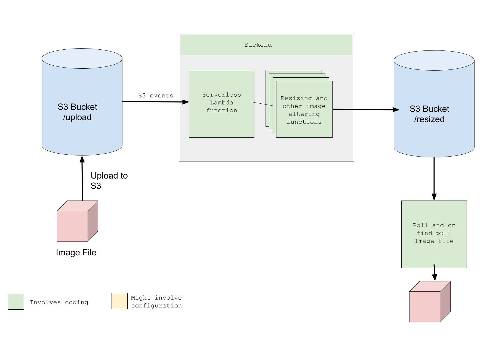

# Overview
An image resizing application for professional photographers.

For API Documentation, refer to https://resizepro.docs.apiary.io

# Contents

[Overview](#Overview)  
[Getting Started Guide](#Getting-Started-Guide)  
[How to Run and Deploy](#How-to-Run-and-Deploy)  
[Troubleshooting](#Troubleshooting)  
[Design](#Design)  
[Implementation](#Implementation)  
[Testing](#Testing)  
[Next Steps](#Next-Steps)  
[Conclusion](#Conclusion)

# Getting Started Guide

# How to Run and Deploy

# Troubleshooting

# Design

We use `AWS Amplify` to upload files to S3.

A Lambda function is triggered upon S3 file upload, processes the file and uploads the output file to another "folder" in the same bucket.

The frontend looks for a file of the same name as uploaded in this other folder in the S3 bucket. It polls till it is available.

*Future idea*: Maybe we can add a "{filename}.txt" file to a 3rd status folder and write numbers from 0 - 100 in the file to denote status of file processing. This can also take status like FAILED, SUCCEEDED, which the frontend can poll for before pulling output file from the output folder

# Implementation

## Frontend configuration

The user configures many settings like `resize_ratio`, `aspect_ratio`, `crop_values` etc on the frontend app. These will be added as features as the app is developed. The backend doesn't take any HTTP triggers, so we are encoding the configurations into the uploaded filename while uploading to S3. This comes with its own set of advantages and disadvantages.

These configurations are made into a JSON string, `base64` encoded and added to filename. So while uploading, the filename would become `UUID() + _ + base64({JSON config})`. The original filename could also be a key-value pair in this JSON.

Please note the limit of a S3 filepath is `1024 bytes`. So if the `original_filename` is too long, skip it. 

*Future idea*: remove this keypair and add the original filename and maybe all metadata to image metadata.

## Upload

AWS Amplify is used to upload the file using Multipart upload from `Storage` class. The file is uploaded to `{S3_BUCKET}/upload/{FILENAME}`

## Download

We poll asynchronously until `{S3_BUCKET}/download/{FILENAME}` exists. So user can upload multiple files at once or one-by-one. And as one or more files become available, its indicated to the user with a download button.

*Future idea*: Each button click can be tracked along with metadata for study.

## Delete

The user can also send delete request to delete original and resized files from server.

## Cleanup

Everyday at say 12am a scheduled lambda runs. It looks for any file in `/upload` and `/download` that is older than 1 day and deletes them.

# Testing

# Next Steps

# Conclusion

If there are any questions or problems in the future, please contact *Prashanth* at *neotheicebird@gmail.com*
